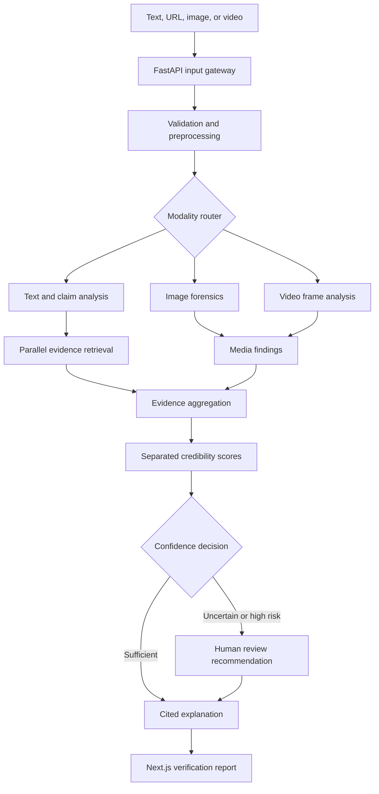

# VeriShield AI

VeriShield AI is a multimodal misinformation and deepfake verification platform for Indian audiences. It accepts text, URLs, images, and videos, analyzes each modality independently, retrieves relevant evidence, and produces a citation-backed report with calibrated uncertainty.

The first vertical slice is implemented: a responsive Next.js composer submits one investigation prompt with an optional image or video attachment to a modular FastAPI service. The API classifies the modality, validates requests with Pydantic, and records them through a SQLAlchemy repository and Supabase Storage adapter, with in-memory and local-file fallbacks for credential-free development.

## Hackathon Context

| Field | Value |
| --- | --- |
| Problem statement | ZAIML-005 - Fake News and Deepfake Detection Platform |
| Team | Team Nodium |
| Team ID | ZeAI_MIH_528 |
| Event | ZeAI Made in India Hackathon 2026 |
| Build window | 24 hours |
| Project name | VeriShield AI |
| Coordination contact | A. Raheesh, Partnership & Collaboration Manager |
| Email | raheesh@zeaisoft.com |

## Product Principle

VeriShield does not reduce verification to a single `fake` or `real` label. It separates:

- Claim credibility: whether retrieved evidence supports the factual claim.
- Media manipulation risk: whether an image, video, or audio stream appears altered or synthetic.
- Context authenticity: whether date, location, caption, and media match.
- Source reliability: the authority, transparency, recency, and independence of the source.
- Evidence confidence: the strength, diversity, and relevance of available evidence.

This distinction handles a common misinformation pattern: genuine media shared with a false caption.

## Prototype Experience

The first screen is the working verification console. A user enters a claim or URL in one field and may attach an image or short video with a specific verification question. The backend classifier routes the request as text, URL, image, or video. The interface then shows analysis progress, a content preview, separate score dimensions, supporting and contradicting evidence, suspicious image regions or video timestamps, limitations, and a human-review recommendation.

Citizen mode prioritizes a clear verdict and readable explanation. Investigator mode exposes evidence details, model signals, source metadata, and review controls. The 24-hour prototype implements one shared responsive workspace rather than separate applications.

## Architecture



The explanation layer receives structured results and evidence. It explains findings but does not act as the detector and may not invent citations.

## Team Split

### Member 1 - Media Forensics

Builds deepfake image and video analysis: metadata, provenance signals, image model integration, adaptive frame sampling, frame aggregation, heat-map data, and suspicious timestamps. Audio spoofing and lip-sync analysis are stretch goals.

### Member 2 - Text and Evidence

Builds claim extraction and misinformation analysis: language handling, search query generation, bounded parallel retrieval, passage extraction, source deduplication, stance classification, source reliability, and citations.

### Member 3 - Platform Integration

Builds the Next.js product, FastAPI gateway, Pydantic contracts, SQLAlchemy/Supabase persistence, agent-style orchestration, progress lifecycle, score aggregation, report generation, integration tests, and runnable demo.

The exact 24-hour schedule, contracts, status board, and handoff gates are in [PLAN.md](./PLAN.md).

## Technology Stack

### Frontend

| Need | Technology |
| --- | --- |
| Web framework | Next.js App Router and React |
| Language | TypeScript with strict mode |
| Styling | CSS Modules plus global design tokens derived from `DESIGN.md` |
| Icons | Lucide React |
| Charts | Recharts for score and trend views |
| API state | Native fetch with a small typed client; TanStack Query only if polling complexity justifies it |
| Testing | Vitest, React Testing Library, Playwright |

### Backend and Orchestration

| Need | Technology |
| --- | --- |
| API framework | FastAPI with modular `APIRouter` controllers and services |
| Language | Python 3.12+ with strict MyPy checks |
| Validation and contracts | Pydantic v2 and generated OpenAPI |
| File uploads | FastAPI `UploadFile` with MIME, signature, and size validation |
| ORM | SQLAlchemy 2 async |
| Persistence | Supabase PostgreSQL |
| Media storage | Supabase Storage through a backend-only adapter |
| Background work | Process-local job service initially; Redis with Dramatiq or Celery when durable workers are required |
| Vector retrieval | Supabase PostgreSQL with pgvector in a later analysis module |
| Migrations | Alembic |
| Testing and quality | Pytest, HTTPX, Ruff, and MyPy |

### AI and Media

| Need | Technology |
| --- | --- |
| Model runtime | PyTorch and Hugging Face Transformers |
| Image processing | OpenCV, Pillow, EXIF extraction, optional C2PA tooling |
| Video processing | FFmpeg and OpenCV |
| Speech transcription | Whisper-compatible adapter |
| Deepfake analysis | Pretrained CNN/ViT frame model behind a versioned adapter |
| Audio spoofing | AASIST/Wav2Vec2-style adapter as stretch scope |
| OCR | Tesseract or an Indic-capable OCR provider |
| LLM tasks | Provider-neutral adapter for claim extraction, stance assistance, and multilingual explanation |
| Fact checking | Google Fact Check Tools API plus official/government and trusted-source search adapters |

### Delivery

| Need | Technology |
| --- | --- |
| Local services | Docker Compose |
| Frontend deployment | Vercel-compatible Next.js build |
| API deployment | Dockerized FastAPI/Uvicorn service with separate analysis workers when available |
| Observability | Structured logs, request IDs, latency per stage, and provider health checks |

Frontend versions are pinned in its lockfile; backend compatibility ranges are declared in `pyproject.toml`. External AI and evidence providers remain adapter-level follow-up work.

## Design Direction

`DESIGN.md` is the primary visual reference. The frontend-design review adapts Cohere's enterprise AI language to an investigative verification tool.

### Subject, audience, and job

- Subject: evidence-backed misinformation and media verification.
- Audience: citizens, journalists, fact-checkers, and institutional reviewers in India.
- Primary job: move from suspicious content to an understandable, inspectable report.

### Compact token system

| Role | Token |
| --- | --- |
| Evidence ink | `#17171C` |
| Signal green | `#003C33` |
| Source navy | `#071829` |
| Working canvas | `#FFFFFF` |
| Evidence blue | `#1863DC` |
| Risk coral | `#FF7759` |

- Display: CohereText with Space Grotesk fallback, used sparingly.
- Body/UI: Unica77 with Inter and system fallbacks.
- Data labels: CohereMono with a practical monospace fallback.
- Letter spacing remains `0` throughout for readability and consistency.
- Major media previews may use the reference's 22px radius; working cards and controls stay at 8px or less.
- Flat surfaces, thin rules, and full-width green/navy focus bands replace heavy shadows and nested cards.

### Signature interaction: Evidence Trace

A persistent Evidence Trace follows the active request through `Input`, `Signals`, `Sources`, and `Verdict`. Each stage opens the evidence produced there and shows unavailable or failed steps honestly. This gives the product a memorable visual identity rooted in auditability, not decoration.

The design deliberately avoids a generic gradient hero, oversized dashboard statistics, decorative glass effects, and a card for every section. Color is reserved for evidence state, risk, and full media/forensic focus areas.

The first design pass would have read as a general enterprise AI dashboard. The subject-specific revision makes the analyzer the opening screen and gives the Evidence Trace the single expressive role. Everything around it stays quiet, precise, and optimized for inspecting sources and forensic findings.

## Evidence Retrieval Strategy

Fast multi-source verification depends on query fan-out and controlled parallelism:

1. Split the input into atomic claims.
2. Generate several focused search queries per claim.
3. Search fact-check, official, news, and archival adapters concurrently.
4. Fetch only a bounded set of high-value results with strict timeouts.
5. Extract relevant passages, remove duplicates, and rerank them.
6. Classify each passage as supporting, contradicting, insufficient, or unrelated.
7. Send only top evidence and source metadata to the explanation layer.

The system does not pretend to deeply read every word on dozens of sites. It selects relevant passages, records provenance, and reports partial results when providers fail.

## Local Development

Start the API:

```bash
cd services/api
python3 -m venv .venv
.venv/bin/pip install -e '.[dev]'
cp .env.example .env
.venv/bin/uvicorn app.main:app --reload --port 4000
```

Start the web app in another terminal:

```bash
cd apps/web
npm install
cp .env.example .env.local
npm run dev
```

Open `http://localhost:3000`. The API listens on `http://localhost:4000/api/v1`, with interactive OpenAPI documentation at `http://localhost:4000/docs`.

Without Supabase credentials, the API intentionally uses an in-memory analysis repository and stores uploaded development files under `services/api/.data/uploads`. Set the database and Supabase values below to use managed persistence and object storage.

## Environment Variables

Sanitized examples are provided in both application workspaces. Together they support:

```text
NEXT_PUBLIC_API_BASE_URL=
TEXT_MAX_LENGTH=10000
IMAGE_MAX_MB=15
UPLOAD_MAX_MB=150
DATABASE_URL=
MIGRATION_DATABASE_URL=
SUPABASE_URL=
SUPABASE_SECRET_KEY=
SUPABASE_STORAGE_BUCKET=analysis-inputs
LLM_API_KEY=
SEARCH_API_KEY=
GOOGLE_FACT_CHECK_API_KEY=
MODEL_CACHE_DIR=
MEDIA_RETENTION_MINUTES=
```

Never commit real values.

## Evaluation

Prototype evaluation should include:

- Text: precision, recall, macro F1, evidence Recall@K, and citation correctness.
- Media: ROC-AUC, false-positive rate, suspicious timestamp usefulness, and behavior after compression.
- Product: end-to-end latency, partial-failure behavior, accessibility, and explanation clarity.

The demo should include at least one supported claim, one contradicted or misleading claim, one genuine media case, one manipulated media case, and one insufficient-evidence case.

## Limitations

No detector can reliably identify every new generator. Compression, cropping, filters, re-recording, missing metadata, translation errors, incomplete search results, and new claims can all reduce confidence. Missing provenance is not proof of manipulation, and source reputation is not a substitute for evidence. Political, health, emergency, and election-related results require human oversight.

## Project Documents

- [AGENTS.md](./AGENTS.md) - instructions for coding agents and ownership boundaries.
- [RULES.md](./RULES.md) - collaboration, status updates, integration, and safety rules.
- [PLAN.md](./PLAN.md) - 24-hour schedule, contracts, risks, and live status.
- [DESIGN.md](./DESIGN.md) - Cohere design-system reference.
- Source report: `Multimodal_Misinformation_Verification_Platform.pdf` supplied outside this repository.

## Current State

The multimodal intake foundation is working end to end. One prompt plus an optional attachment is classified as text, URL, image, or video and can be polled through the shared API. Media objects use `analyses/{analysis_id}/input.{ext}`, keeping database and storage identity aligned. The current response represents request intake and lifecycle state; media-forensics models, text evidence retrieval, credibility scoring, and final reports are the next parallel workstreams.

Verification completed for the current slice:

- Frontend lint, strict TypeScript, unit tests, and production build.
- Backend Ruff lint, 12 Pytest cases, and Alembic migration review.
- Browser submission from the Next.js UI to the FastAPI service.
- Desktop and 390px mobile visual checks.
